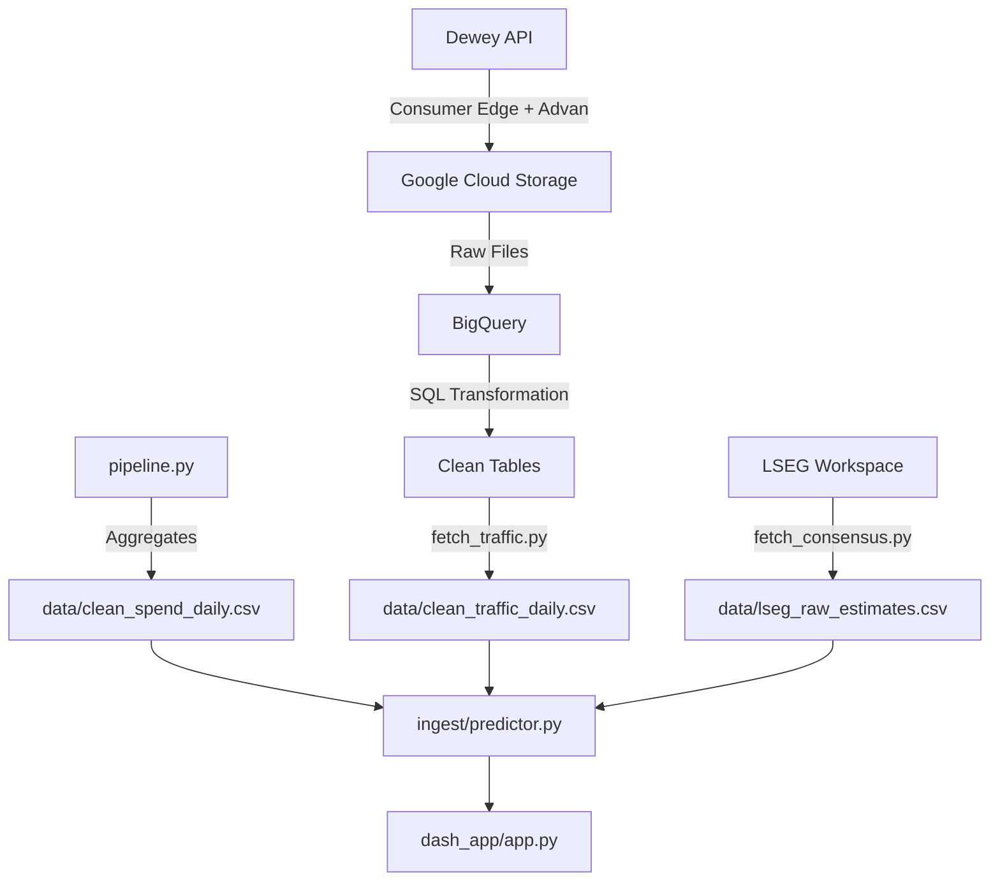

# GEMINI.md

This file provides context and guidance for Gemini regarding the Alt-Data Pulse Dashboard project.

## Project Overview

**Alt-Data Pulse Dashboard**: A "Hedge Fund Grade" quantitative signal platform for QSR (Quick Service Restaurant) equities.
**Goal**: Generate tradeable alpha signals by fusing alternative data (Consumer Edge credit card spend, Advan foot traffic) and comparing revenue predictions against live Wall Street consensus.
**Current State**: The project has migrated from a Streamlit prototype to a production-ready **Plotly Dash** application with a Bloomberg Terminal-style aesthetic.

## key Commands

### Dashboard (Primary)
```bash
# Run the Plotly Dash production dashboard (localhost:8050)
python dash_app/app.py
```

### Data Pipeline (Ingestion & Processing)
```bash
# Run the full data pipeline (Dewey download -> GCS -> BigQuery -> Local CSV)
python ingest/pipeline.py --full --start-date 2023-01-01

# Fast run (Process local files only, skips download)
python ingest/pipeline.py --local

# Fetch latest Wall St. estimates (Requires LSEG Workspace Desktop App running)
python ingest/fetch_consensus.py

# Download latest Traffic data from BigQuery to local CSV
python ingest/fetch_traffic.py
```

### Analysis & Testing
```bash
# Test the Revenue Predictor logic (prints R² and Deltas to console)
python ingest/predictor.py
```

## Architecture

### Data Flow


### Key Components

#### `dash_app/` — Production Dashboard (Dash)
*   **`app.py`**: Main application entry point, layout, and callbacks.
*   **`utils.py`**: Data loading layer; initializes the `RevenuePredictor` singleton.
*   **`charts.py`**: Plotly chart builders with custom Bloomberg dark theme.
*   **`assets/styles.css`**: CSS variables and styles for the terminal aesthetic.

#### `ingest/` — Data Engineering
*   **`pipeline.py`**: ETL orchestrator (Dewey -> GCS -> BigQuery).
*   **`predictor.py`**: Core quant engine. Fuses spend/traffic data, applies fiscal calendar logic, and generates revenue predictions.
*   **`lseg_client.py`**: Client for LSEG/Refinitiv consensus data.

## Configuration & Environment

**Required `.env` variables:**
*   `DEWEY_API_KEY`: API key for Dewey Data.
*   `GCP_PROJECT_ID`: Google Cloud project ID.
*   `BQ_DATASET_ID`: BigQuery dataset ID.
*   `GCS_BUCKET_NAME`: Google Cloud Storage bucket name.

## Data Files

Located in `data/` (mostly gitignored):
*   `clean_spend_daily.csv`: Aggregated credit card spend data.
*   `clean_traffic_daily.csv`: Advan foot traffic data.
*   `lseg_raw_estimates.csv`: Wall Street consensus estimates.
*   `news_cache.json`: Cache for news feed data.

## Development Standards
*   **Style**: Bloomberg Terminal Dark Theme (Dark blue `#0a0e27`, Grid `#30363d`, Monospace fonts).
*   **Framework**: Plotly Dash + Bootstrap Components.
*   **Charts**: Plotly Graph Objects (not Express) for fine-grained control.
