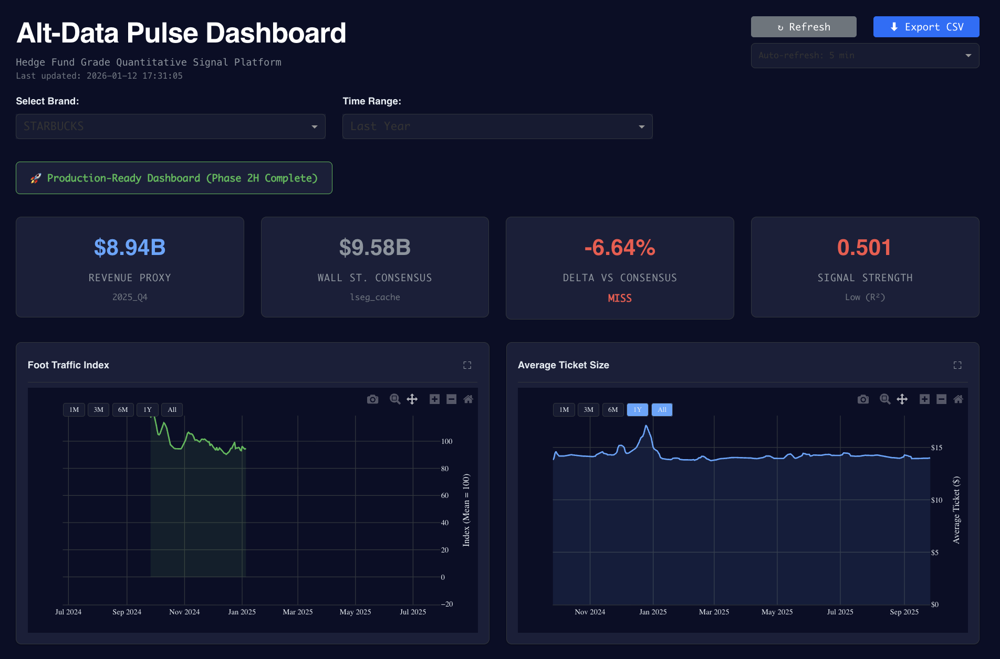
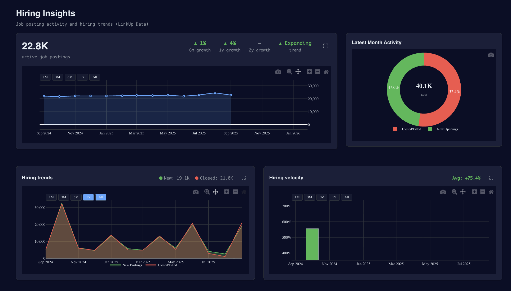
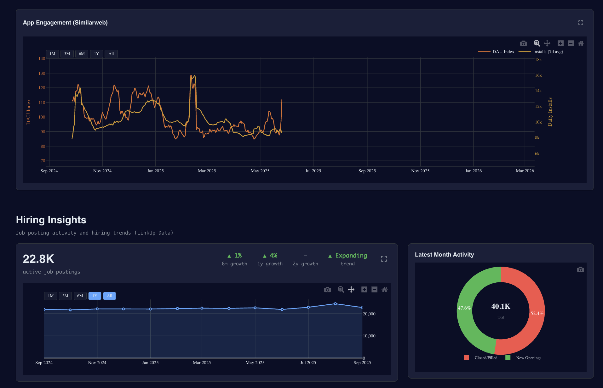
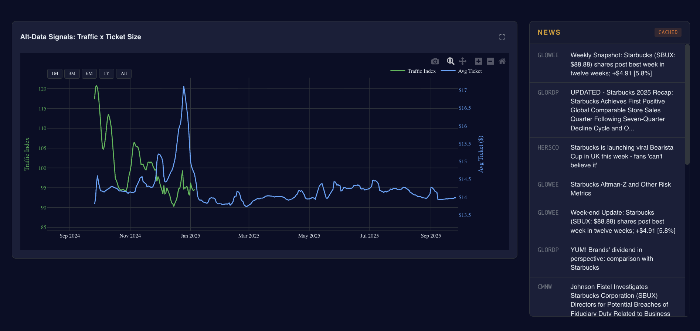

# Alt-Data Pulse Dashboard

Alt-Data Pulse is a portfolio-ready analytics dashboard that blends alternative data (spend, traffic, hiring, and app engagement) with consensus context to surface revenue momentum ahead of earnings. The interface is designed to feel like a modern, Bloomberg-style terminal: dense, fast to scan, and tuned for decision-making.

## Screenshots

<table>
  <tr>
    <td></td>
    <td></td>
  </tr>
  <tr>
    <td></td>
    <td></td>
  </tr>
</table>

## Why It Matters

Traditional earnings models lag reality. Alt-Data Pulse focuses on real-world behavior (transactions, visits, hiring demand, and engagement) so trends show up weeks earlier, with clear deltas versus consensus.

## Key Capabilities

- Revenue Proxy vs Wall Street Consensus with beat/miss deltas.
- Brand selector and time-range filters to compare momentum quickly.
- Foot traffic and ticket-size trends with rolling averages.
- Hiring insights dashboard for labor demand and staffing velocity.
- App engagement signals to triangulate brand momentum.
- News panel for qualitative context alongside quantitative signals.
- Bloomberg-style dark theme optimized for long sessions.

## Signal Coverage

- Spend and transactions (daily granularity).
- Foot traffic index with rolling averages.
- Hiring signals (job postings, growth, and velocity).
- App engagement metrics (DAU, installs, usage intensity).
- Optional consensus data (LSEG-compatible CSV).

## Tech Stack

- Python, Pandas, NumPy, SciPy, Statsmodels
- Streamlit UI with Altair charts
- Optional Plotly components for richer interactions
- Google Cloud Storage + BigQuery loaders

## Architecture

```
alt-data-pulse/
├── dashboard/            # Streamlit UI
├── ingest/               # Data pipelines + predictor
├── data/                 # Cleaned CSVs + cached outputs
├── notebooks/            # Analysis + experimentation
└── docs/screenshots/     # Portfolio screenshots
```

## Run Locally

```bash
python -m venv .venv
source .venv/bin/activate
pip install -r requirements.txt
streamlit run dashboard/app.py
```

## Data Pipeline

```bash
python ingest/pipeline.py --full --start-date 2023-01-01
```

Outputs land in `data/` and are loaded by the dashboard.

## Roadmap

- Incremental refresh pipeline for near-real-time updates.
- Expanded coverage beyond QSR to other consumer categories.
- Workspace tabs and multi-layout views.
- Deeper news and sentiment integrations.

---

